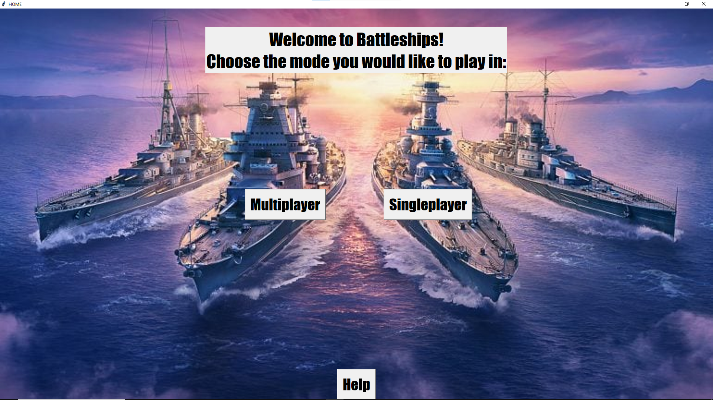
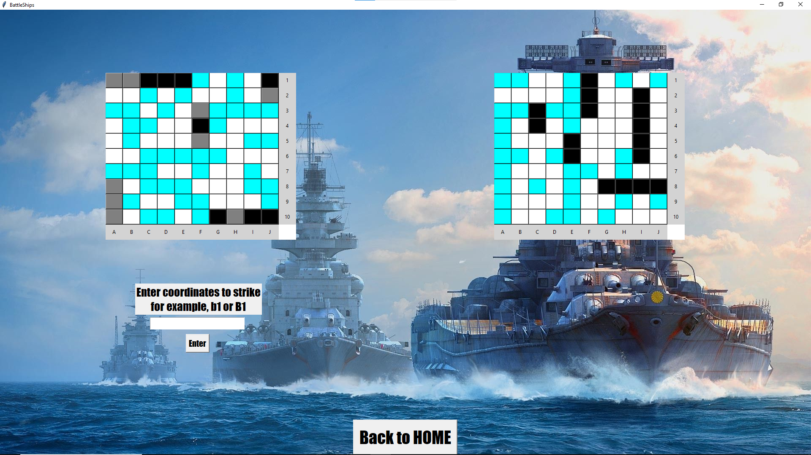
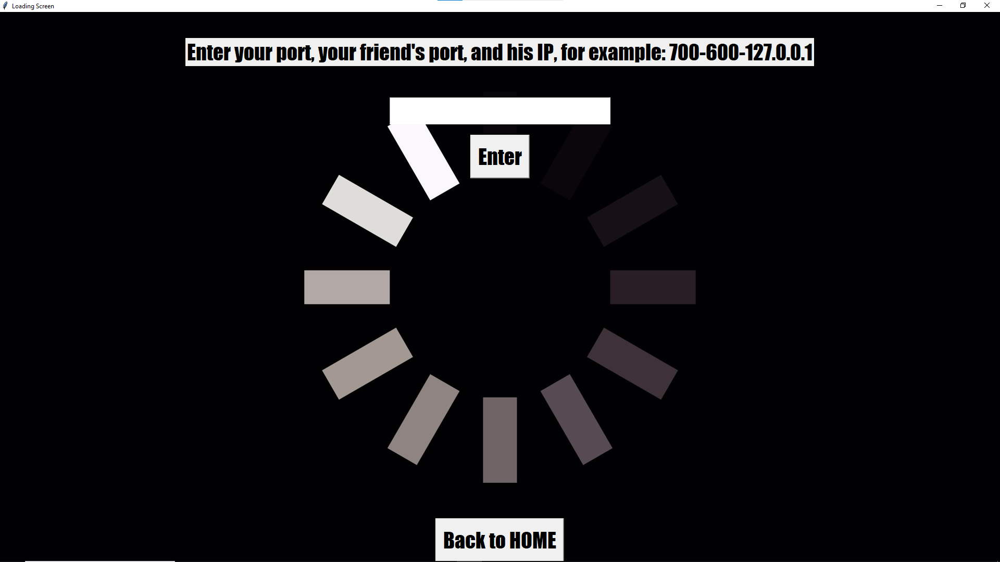

# 🚢 Python-BattleShips

> **A Classic Battleship Game — Online and Offline Multiplayer**

---

## 🧭 Table of Contents

- [Introduction](#-introduction)
- [Features](#-features)
- [Technology Stack](#-technology-stack)
- [Gameplay Modes](#-gameplay-modes)
- [Installation](#-installation)
- [Usage](#%EF%B8%8F-usage)
- [Examples](#%EF%B8%8F-examples)
- [Code Overview](#-code-overview)
- [Security Considerations](#-security-considerations)
- [Troubleshooting](#-troubleshooting)
- [Contributors](#-contributors)
- [License](#-license)

---

## 📘 Introduction

**Python-BattleShips** is a feature-rich Python implementation of the classic game Battleships, supporting both **offline AI gameplay** and **online multiplayer**. Designed with education and fun in mind, this project was created as a final-year submission for a high school cyber-program in Israel, accounting for **30% of the official Bagrut grade** in Software Engineering.

> _“I had a blast developing this game — learning Python libraries like `tkinter`, `pygame`, and `socket` while building something truly fun and interactive.”_

---

## ✨ Features

- 🎮 **Singleplayer Mode** – Battle against an AI with randomized ship placement and attack logic
- 🌐 **Multiplayer Mode** – Connect to a friend via local network or IP for real-time play
- 📦 **Graphical UI** – Built with `tkinter` for an interactive and user-friendly layout
- 🖼 **Custom Backgrounds** – Background images randomly displayed each session
- 🔊 **Sound Effects** – Victory and defeat music using `pygame.mixer`
- 🧠 **Threaded Networking** – Smooth, non-blocking online gameplay using `threading`
- ⚙️ **Fully Interactive Grid System** – Hit, miss, and sunk ships visualized instantly

---

## 🛠 Technology Stack

| Component      | Library / Tool         |
|----------------|-------------------------|
| Programming    | Python 3.10+            |
| GUI            | `tkinter`, `Pillow`     |
| Audio          | `pygame`                |
| Networking     | `socket`, `threading`   |
| Input Parsing  | `re`, `json`, `random`  |
| Platform Utils | `os`, `time`, `sys`     |

---

## 🎮 Gameplay Modes

### 🧍‍♂️ Single Player
- Place ships on a 10x10 grid.
- Compete against an AI that selects targets randomly.
- Immediate visual feedback on hits, misses, and game conclusion.

### 👥 Multiplayer
- Host or connect to another player using IP/Port.
- Ships are placed manually; communication is synchronized via sockets.
- Turn-based real-time combat with win/loss detection and feedback.

---

## 💾 Installation

### Prerequisites

- Python 3.10 or newer
- Install required libraries:
  ```bash
  pip install pygame Pillow
  ```

### Run

```bash
# From the project root:
python main.py
```

---

## ▶️ Usage

After launching the game with:

```bash
python main.py
```

You will be presented with a **Home Screen** offering three main options:

### 🎮 Singleplayer
- Click **Singleplayer** to play against an AI.
- Follow the prompts to place your ships.
- Enter coordinates (e.g., `A1`, `J10`) to attack the computer's board.

### 🌐 Multiplayer
- Click **Multiplayer** to play against a friend.
- You will be prompted to enter:
  ```
  <your_port>-<friend_port>-<friend_ip>
  ```
  For example:
  ```
  7000-7001-127.0.0.1
  ```
- Make sure both players are on the same network or port-forwarded.
- Ships are placed in turns, and the game proceeds in real-time.

### 🆘 Help
- Click **Help** to view instructions and gameplay rules.

> 🔁 At any time, use the “Back to Home” button to return to the main menu.

---

## 🖼️ Examples

A few screenshots to showcase the game’s interface and features:

### 🏠 Home Screen
Main window where players choose between Singleplayer or Multiplayer modes.  


---

### 🎯 Singleplayer Mode  
User and AI boards displayed side-by-side for interactive battles.  


---

### 🌐 Multiplayer Setup  
Enter your port, your friend’s port, and their IP to connect.  


---

### 🏁 Victory/Defeat  
Custom end-game screens with unique images and sounds.  


---

## 🔍 Code Overview

### 🧠 `MainWindow`
- Handles UI for selecting Singleplayer, Multiplayer, or Help.
- Plays looping background music.
- Launches the respective game mode or instructions.

### 🧠 `SinglePlayer`
- Sets up ship placement.
- Manages turn-based combat against AI.
- Contains ship validation and grid rendering.

### 🧠 `MultiPlayer`
- Exchanges port/IP information to establish connection.
- Syncs ship placement and move validation in real time.
- Uses `threading` for asynchronous data handling.

### 🧠 `Loading`
- Collects connection information (ports and IP).
- Attempts to establish socket connection with peer.
- Handles connection order and initiates multiplayer session.

---

## 🔐 Security Considerations

- **Socket Communication** is unencrypted — recommended only for local or trusted networks.
- **User Input** is validated for coordinate format (e.g., A1, J10).
- **Threading Safety** is handled to ensure GUI remains responsive during multiplayer games.
- **Port Restrictions** are enforced (0–65535) during input validation.

---

## 🩺 Troubleshooting

| Issue                              | Solution                                       |
|-----------------------------------|------------------------------------------------|
| Game doesn’t launch               | Make sure `pygame` and `Pillow` are installed |
| Sounds not playing                | Confirm audio hardware & `pygame.mixer` init  |
| Multiplayer not connecting        | Check IP/port inputs and firewall permissions |
| App crashes on bad input          | Use valid coordinates like `A1`, `B4`, etc.   |
| Game stuck on connection attempt  | Ensure both machines are on same network      |

---

## 👨‍💻 Contributors

- **Chen Shor** – Developer, Designer  
  > Ben Gurion High School – Cybersecurity Track  
  Guided by **Lina Schmidt**

---

## 📄 License

**MIT License**  
You are free to use, modify, and distribute this project with proper attribution.
